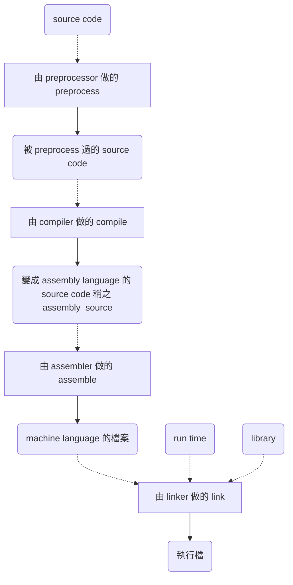

## 5.1 compile就只是compile而已

一開始突然寫一個「什麼都不做」程式也不有趣。先來把一個經典程式「hello, world」程式給編譯執行吧。

### 輸入程式並保存

就選一個自己喜歡的編輯器吧。注意，這個讀書筆記***只以linux為例***，原書還有提到Windows跟Mac。這裡就以vim來說明吧。假設希望寫一個C程式，那麼首先打開終端機(terminal)，輸入`vim 檔名.c`(此例是hello.c)。按下Enter後就會進入vim的程式畫面，按下`i`後就可以開始寫。內容如下:

```cpp
#include <stdio.h>
int main(){
	printf("hello, world\n");
    return 0;
}
```
把上面這段程式抄完後，按下`ZZ`儲存並離開(就是連續兩個大寫Z)。

### compile並實行

離開vim後，再打入`gcc -g -Wall 檔名.c -o 檔名`就會編譯(以這個例子來說是`gcc -g -Wall hello.c -o hello`)。編譯完後什麼訊息都沒出現代表成功，否則就要按照編譯器的錯誤或警告信息看看原程式有什麼問題。接下來再打`./檔名`就會執行，以這個例子來說就是打`./hello`。

###什麼都不做的程式
_ _ _
``` cpp
#include <stdio.h>
int main(){
	
}
```
這裡把這個程式以nop.c這個檔名存起來，nop代表的是No OPeration，什都不做的意思。這個程式就算執行也什都不會發生，因為程式裡面並沒有做任何處理。

###看看assembly source吧
_ _ _
可以把上面這個程式做compile變成執行檔的gcc這個命令，其實並不只單單做compile而已，這個命令把preprocess, compile, assemble, 再來是link等等的動作都一起做了。


>preprocess: compile前的預處理
>compile: 把被預處理過的source code變成assembly  source
>assemble: 把assembly source變成machine language的檔案
>link: 把必要的library等等結合起來生成一個執行檔

由於我們只需要打`gcc xxx.c`一個指令就可以生成執行檔，所以可能會有compile = 生成執行檔的這個誤會。
那麼，如果我們只做compile這個動作，我們需要給`gcc`這個指令加上`-S`這個operation。用以上的範例，我們打 `gcc -S nop.c`會在當前的目錄下生成nop.s，就是nop.c的assembly source。
以下是我的電腦生成的nop.c的assembly source。
```asm
	.file	"nop.c"
	.text
	.globl	main
	.type	main, @function
main:
.LFB0:
	.cfi_startproc
	pushq	%rbp
	.cfi_def_cfa_offset 16
	.cfi_offset 6, -16
	movq	%rsp, %rbp
	.cfi_def_cfa_register 6
	movl	$0, %eax
	popq	%rbp
	.cfi_def_cfa 7, 8
	ret
	.cfi_endproc
.LFE0:
	.size	main, .-main
	.ident	"GCC: (Ubuntu 5.4.0-6ubuntu1~16.04.2) 5.4.0 20160609"
	.section	.note.GNU-stack,"",@progbits
```
以上是用intel的處理器生成的assembly source，不同的處理器(比如ARM)生成的assembly source也會不同。雖然這本是C語言的入門書，不會解釋assembly，但請記得下面兩點:
* compile是指把source code翻譯成assembly language的source code的動作
* 就算是一模一樣的c source code，根據電腦的機種還有OS的不同，會生出完全不同的assembly source。